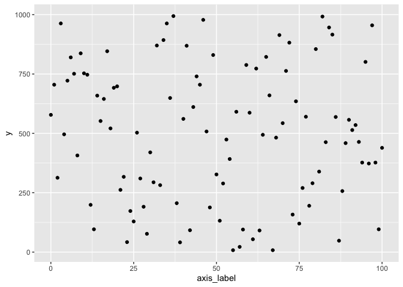

# pLtemplate

<!-- badges: start -->
<!-- badges: end -->

The goal of pLtemplate is to provide a consistent theme for ggplot
graphics in the Paegel lab.

## Installation

You can install pLtemplate from [GitHub](https://github.com/) with:

``` r
# install.packages("devtools")
devtools::install_github("vcavett/pLtemplate")
```

## Example

This is a sample scatter plot using the Paegel lab theme.

``` r
library(tidyverse)
#> ── Attaching packages ─────────────────────────────────────── tidyverse 1.3.0 ──
#> ✓ ggplot2 3.3.3     ✓ purrr   0.3.4
#> ✓ tibble  3.1.1     ✓ dplyr   1.0.5
#> ✓ tidyr   1.1.3     ✓ stringr 1.4.0
#> ✓ readr   1.4.0     ✓ forcats 0.5.1
#> ── Conflicts ────────────────────────────────────────── tidyverse_conflicts() ──
#> x dplyr::filter() masks stats::filter()
#> x dplyr::lag()    masks stats::lag()
library(pLtemplate)
#> Loading required package: magrittr
#> 
#> Attaching package: 'magrittr'
#> The following object is masked from 'package:purrr':
#> 
#>     set_names
#> The following object is masked from 'package:tidyr':
#> 
#>     extract

data <- tibble(x = 0:100, y = sample(1:1000, 101, replace=TRUE))
data %>% ggplot() + aes(x, y) + geom_point() + theme_pL()
```


