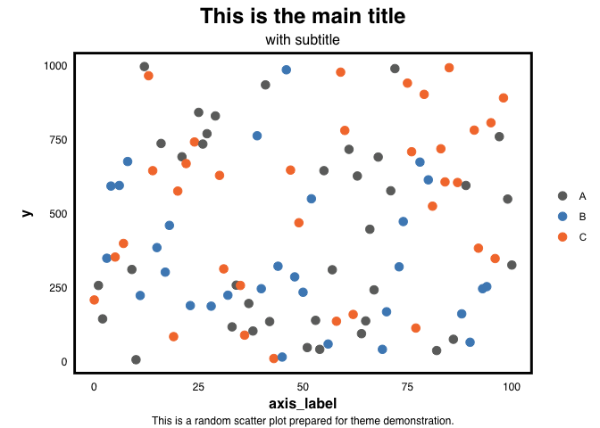

# pLtemplate

<!-- badges: start -->
<!-- badges: end -->

The goal of pLtemplate is to provide a consistent theme for ggplot
graphics in the Paegel lab.

## Installation

You can install pLtemplate from [GitHub](https://github.com/) with:

``` r
# install.packages("devtools")
devtools::install_github("vcavett/pLtemplate")
```

## Example

This is a sample scatter plot using the Paegel lab theme.

``` r
library(tidyverse)
#> ── Attaching packages ─────────────────────────────────────── tidyverse 1.3.1 ──
#> ✓ ggplot2 3.3.3     ✓ purrr   0.3.4
#> ✓ tibble  3.1.1     ✓ dplyr   1.0.6
#> ✓ tidyr   1.1.3     ✓ stringr 1.4.0
#> ✓ readr   1.4.0     ✓ forcats 0.5.1
#> ── Conflicts ────────────────────────────────────────── tidyverse_conflicts() ──
#> x dplyr::filter() masks stats::filter()
#> x dplyr::lag()    masks stats::lag()
library(pLtemplate)
#> Loading required package: magrittr
#> 
#> Attaching package: 'magrittr'
#> The following object is masked from 'package:purrr':
#> 
#>     set_names
#> The following object is masked from 'package:tidyr':
#> 
#>     extract
library(scales)
#> 
#> Attaching package: 'scales'
#> The following object is masked from 'package:purrr':
#> 
#>     discard
#> The following object is masked from 'package:readr':
#> 
#>     col_factor

data <- tibble(x = 0:100,
                             y = sample(1:1000, 101, replace=TRUE),
                             z = sample(LETTERS[1:3], 101, replace = TRUE),
                             a = sin(x))

data %>% ggplot() +
    aes(x, y,
            col = z) +
    geom_point(size= 3) +
    xlab("axis_label") +
    labs(title = "This is the main title",
             subtitle = "with subtitle",
             caption = "This is a random scatter plot prepared for theme demonstration.") +
  theme_pL() +
    scale_color_pL()
```



``` r
data %>% 
    ggplot() +
    aes(x, a) +
    geom_line() +
    scale_y_continuous(limits = c(-1,1), breaks = c(-1, 0, 1)) +
    labs(title = "line plot example",
             subtitle = "with subtitle",
             caption = "and a small descriptive caption describing the data") +
    theme_pL()
```


``` r
data %>% 
    group_by(z) %>% 
    summarize(letters = n(),
                        err = letters - dim(data)[1] / n_distinct(data$z))  %>% 
    ggplot() +
    aes(x = z, 
            y = letters) +
    geom_col() + 
    geom_errorbar(aes(ymin = letters - err,
                                        ymax = letters + err),
                                width = 0.2) +
    labs(title = "bar plot",
             subtitle = "by request") +
    theme_pL() +
    scale_fill_pL()
```


Some graphical elements will still need to be set manually (eg, axis
breaks).
