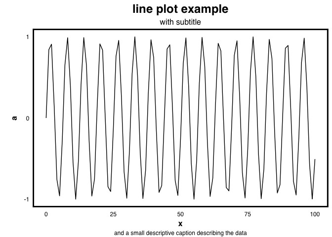

# pLtemplate

<!-- badges: start -->
<!-- badges: end -->

The goal of pLtemplate is to provide a consistent theme for ggplot
graphics in the Paegel lab.

## Installation

You can install pLtemplate from [GitHub](https://github.com/) with:

``` r
# install.packages("devtools")
devtools::install_github("vcavett/pLtemplate")
```

## Example

This is a sample scatter plot using the Paegel lab theme.

``` r
library(tibble)
library(pLtemplate)
#> Loading required package: ggplot2
#> Loading required package: magrittr

data <- tibble(x = 0:100,
                             y = sample(1:1000, 101, replace=TRUE),
                             z = sample(LETTERS[1:3], 101, replace = TRUE),
                             a = sin(x))

data %>% ggplot() +
    aes(x, y,
            col = z) +
    geom_point(size= 3) +
    xlab("axis_label") +
    labs(title = "This is the main title",
             subtitle = "with subtitle",
             caption = "This is a random scatter plot prepared for theme demonstration.") +
  theme_pL() +
    scale_color_pL()
```


``` r
data %>% ggplot() +
    aes(x, a) +
    geom_line() +
    labs(title = "line plot example",
             subtitle = "with subtitle",
             caption = "and a small descriptive caption describing the data") +
    theme_pL()
```



Some graphical elements will still need to be set manually (eg, axis
breaks).
